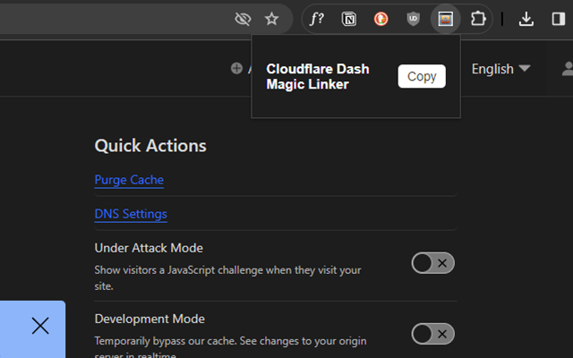

# cloudflare-magic-linker
Chrome extension for copying magic deep links into the Cloudflare dashboard

Supports:
- `:account` - Account ID for the Dashboard and Zero Trust
- `:zone` - Zone domain name
- `:pages-project` - Pages project name
- `:pages-deployment` - Pages deployment ID
- `:worker` - Worker support

## Usage
1. Install the extension using one of the methods below
2. Navigate to the Cloudflare dashboard and click the extension icon in the toolbar
3. Click the "Copy" button on a page you want to link to
4. Share the magic link with your team

> [!TIP] 
> The Zero Trust dashboard's support for deep links is currently less mature than the regular dashboard, so some links may not work as expected. Make sure to test your links before sharing them.

## Installation
### From Chrome Webstore (*recommended*)
For Chrome, get [Cloudflare Magic Linker on the Chrome Webstore](https://chromewebstore.google.com/detail/fongdcpejhfehpdcahcjncgfhkepoico)

### From Mozilla Add-Ons Store
For Firefox, get [Cloudflare Magic Linker on the Mozilla Add-Ons Store](https://addons.mozilla.org/en-US/firefox/addon/cloudflare-magic-linker/)

### From Source
1. Clone this repo
2. Open Chrome and navigate to `chrome://extensions`
3. Enable developer mode
4. Click "Load unpacked" and select the cloned repo

### From Zip
1. Download the [latest release](https://github.com/mackenly/cloudflare-magic-linker/releases/latest/download/cloudflare-magic-linker.zip)
2. Select the zip as an unpacked extension in your browser (specific instructions vary by browser)

## Contributing
Pull requests are welcome. For major changes, please open an issue first to discuss what you would like to change on [mackenly/cloudflare-magic-linker](https://github.com/mackenly/cloudflare-magic-linker).

## License
[GNU GPL v3](./LICENSE)

Not associated or endorsed by Cloudflare. Cloudflare™️ is a trademark of Cloudflare, Inc.
